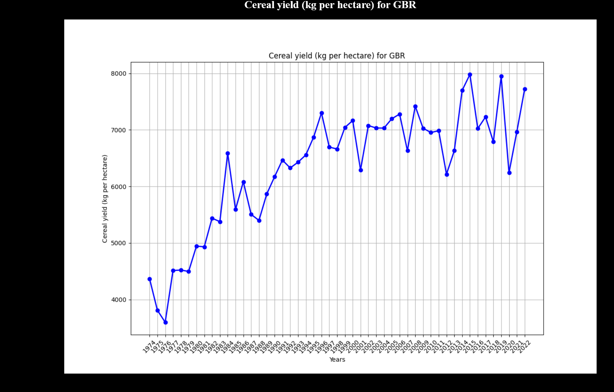
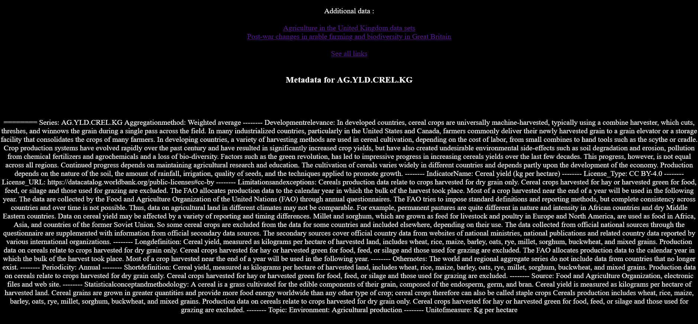
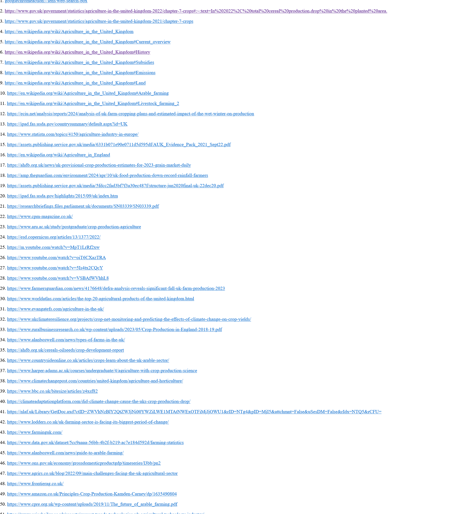
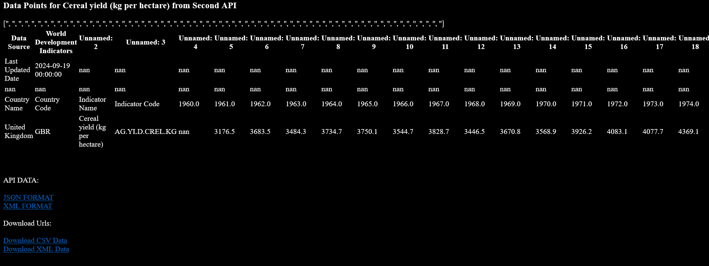

# world-bank-document-maker
------------------------------------------------------------------------------------------------------
Creates documents for all data bank indicators for all countries .  Total possible documents 443,424
----------------------------------------------------------------------------------------------------------


-----------------------------------------------------------------------------
```
python doc-api.py
```
```
enter wb indicator
```
```
entery country code
```

* Creates an html page and embeds the chart into the page.
* Generates metadata for indicator and saves to html file below the plotted chart.
* Generates year and value data below metadata.

  

```
search.py
```
creates 100 links related to the subject , input search query and country code. Saves to same folder as document as 'links.html'
the file is auto linked to the created document as a supplimentary file , click ' see all links' .




Additional data and downloads for xml and csv files plus live links to api data.



```
zipper.py
```
Zips the forlder containing document files.
```
mail.py
```
emails the folder as an attachment.
